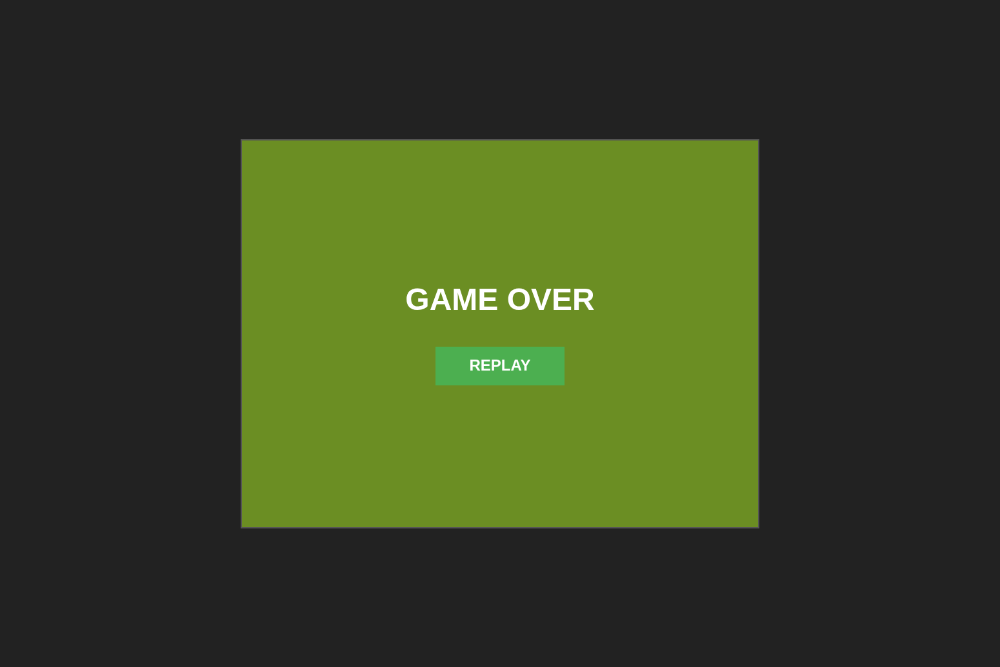

# 縦スクロールシューティングゲーム

ブラウザベースのレトロな縦スクロールシューティングゲームです。TypeScriptとViteで構築されています。



## ゲーム概要

このプロジェクトでは、シンプルなレトロな縦スクロールシューティングゲームを実装しています。プレイヤーはマウスで操作する自機を動かし、敵や敵の弾を避けながら、自機の弾で敵を破壊します。衝突が発生するとゲームオーバーとなり、リプレイボタンでゲームを再開できます。

## 特徴

- マウスで操作するプレイヤー機
- 画面上部から出現し、プレイヤーに向かって弾を発射する敵
- 衝突判定システム
- ゲームオーバー処理とリプレイオプション
- スクロール背景

## 操作方法

- マウスでプレイヤー機を移動
- スペースキーで弾を発射

## 開発環境のセットアップ

```bash
# 依存関係のインストール
pnpm install

# 開発サーバーの起動
pnpm dev

# 本番用ビルド
pnpm build
```
