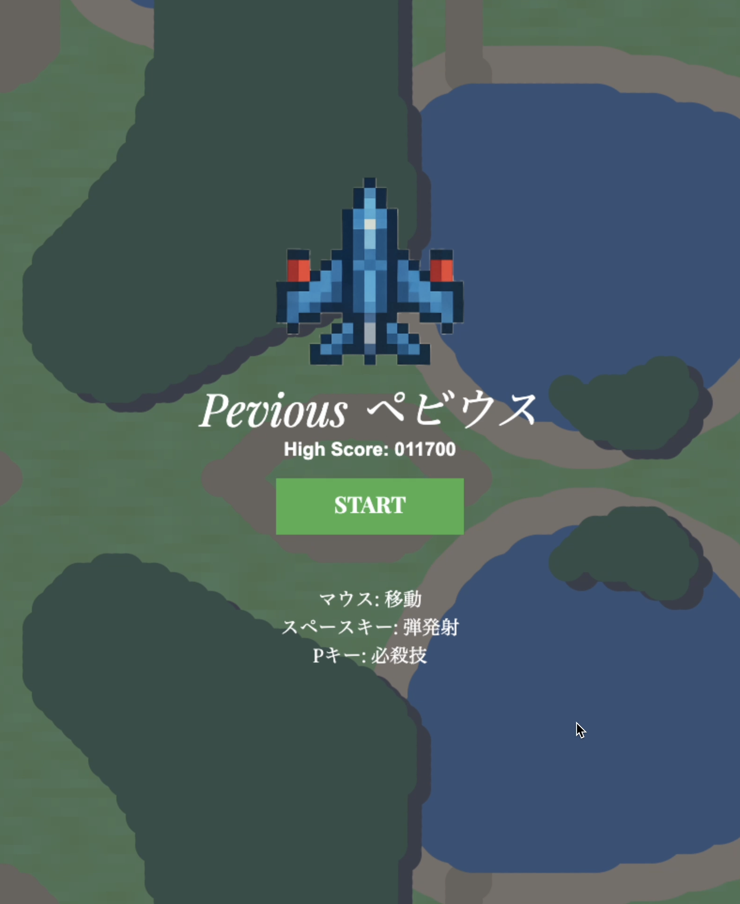
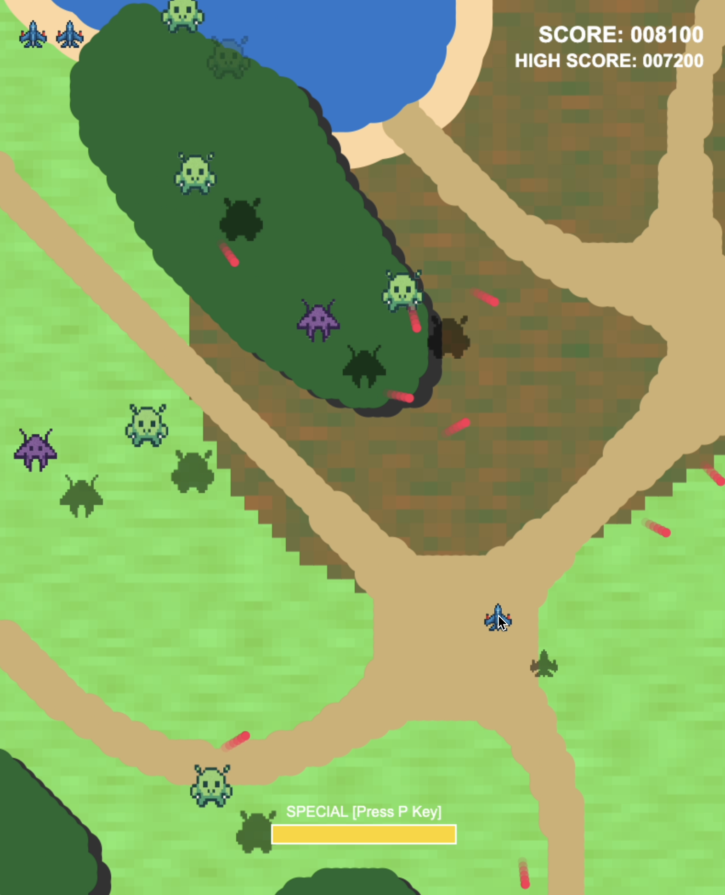
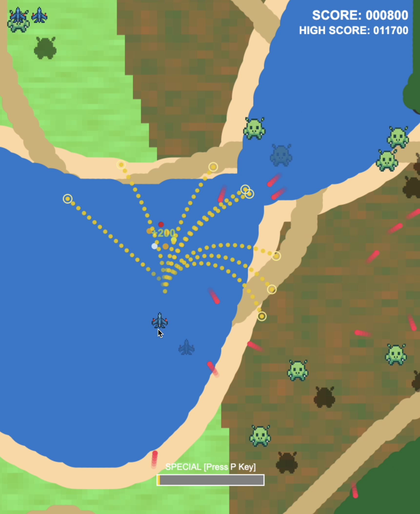
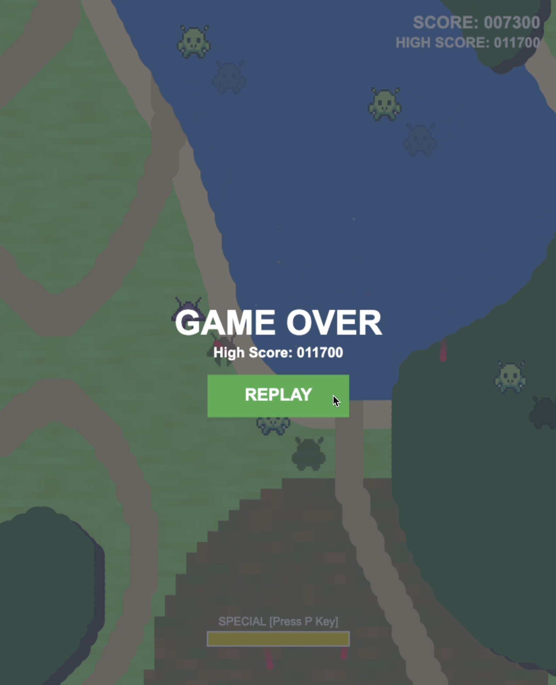
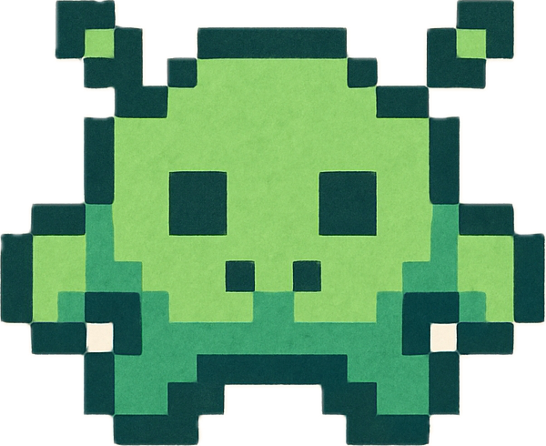
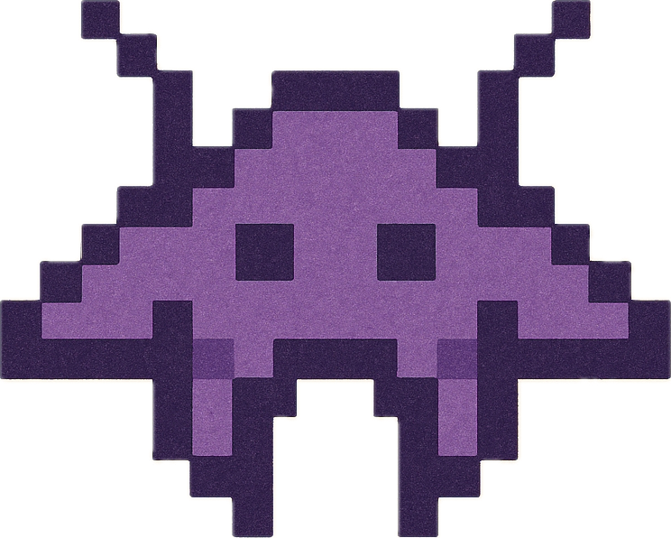
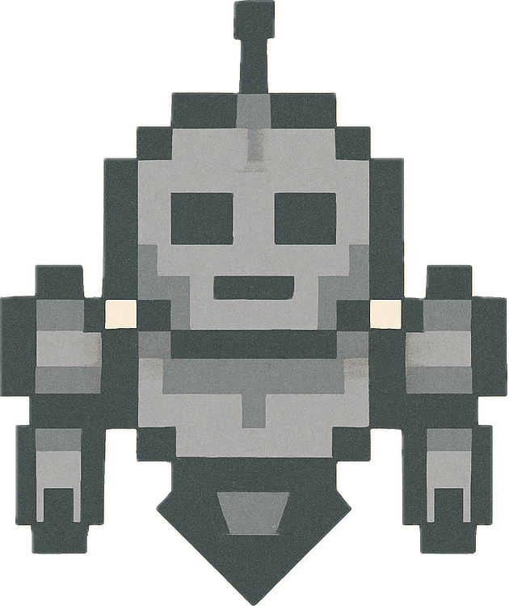

# 🎮 Pevious ペビウス

[**pevious.peruki.dev**](https://pevious.peruki.dev)

<div align="center" style="display: flex; gap: 2px">
</img>
</img>
</img>
</img>
</div>

## 🌌 ストーリー

遥か彼方の宇宙、うどん星系に位置する惑星「うどん星」。そこは麺類を愛する高度な文明を持つ宇宙人たちの故郷でした。

数千年前、うどん星の住民たちは宇宙探査の途中で地球を発見しました。地球の豊かな小麦畑と清らかな水を見た彼らは、「こここそが究極のうどんを作れる理想郷だ！」と確信したのです。

しかし、地球にはすでに人類という知的生命体が住んでいました。うどん星人たちは長い間、地球を手に入れる機会を狙い続けていたのです。

そして今、ついにその時が来ました。うどん星の大艦隊が地球侵略を開始したのです！

**地球を宇宙人が侵略してきた！できるだけたくさん倒して地球の平和を守ろう！**

あなたは地球防衛軍のエースパイロット。愛機「ペビウス」に乗り込み、うどん星からの侵略者を迎え撃て！地球の小麦畑と、そして人類の未来を守るのだ！

## 👾 敵キャラクター紹介

### サヌキー（通常敵・緑色）


うどん星軍の標準的な戦闘機。讃岐うどんの故郷にちなんで名付けられました。
- **特徴**: バランスの取れた性能を持つ基本的な敵
- **攻撃パターン**: 規則的な弾幕攻撃
- **危険度**: ★☆☆☆☆

### イナニワン（俊敏敵・紫色）


稲庭うどんのように細く俊敏な動きが特徴の高速戦闘機。
- **特徴**: 非常に素早い動きで翻弄してくる
- **攻撃パターン**: 高速移動からの奇襲攻撃
- **危険度**: ★★★☆☆

### キシメンガー（重装敵・灰色）


きしめんのように平たく重厚な装甲を持つ重戦車型戦闘機。
- **特徴**: 厚い装甲と強力な火力を誇る
- **攻撃パターン**: 重厚な弾幕で圧倒してくる
- **危険度**: ★★★★★

## 🚀 技術スタック

- **フロントエンド:** HTML5 Canvas2D
- **言語:** TypeScript
- **パッケージマネージャー:** pnpm
- **ビルドツール:** Vite

## 🕹️ 操作方法

- 🖱️ マウスでプレイヤー機を移動
- ⌨️ スペースキーで弾を発射
- ⌨️ Pキーで必殺技を発動

## 🛠️ 開発環境のセットアップ

```bash
# 依存関係のインストール
pnpm install

# 開発サーバーの起動
pnpm dev

# 本番用ビルド
pnpm build
```

## 🎵 クレジット

### 効果音

- [無料効果音で遊ぼう！様](https://taira-komori.jpn.org/index.html) 
- [効果音ラボ 様](https://soundeffect-lab.info/sound/)

### 画像
- ChatGPTによる生成

### BGM
- SUNO AIによる生成

SUNO AI (無料枠) 生成音楽の使用により、このプロジェクトは商用利用できません。

## 📄 開発物について

本開発物は、Devin主体によるソフトウェア開発の試みとして制作したものです。